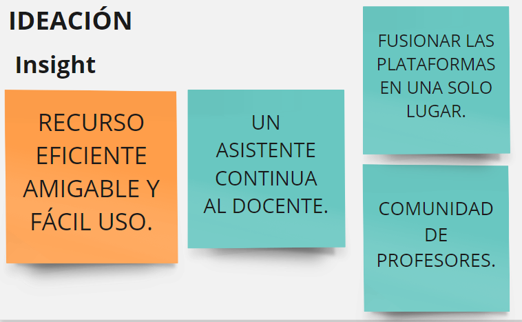

# Reto.0--How-Might-We--TeamsRoms
Primer reto de equipo sobre el rediseño de la experiencia educativa remota en el contexto actual de la educación.

## TEAM: ROMS 
* Milagros Vásquez Cainicela        
* Rosa Gutiérrez Romero     
* Siannet Flores Moran

## Contenido
* 1. Resumen Ejecutivo
* 2. How Might We
* 3. Metodología de trabajo
*   3.1. Design Thinking 
*   3.1.1. Empatizar
*   3.1.2. Definir
*   3.1.2.1. How Might We 
*   3.1.2.2. Elaboración de la entrevista
*   3.1.3. Idear
*   3.1.4. Prototipar
*   3.1.4.1. Prototipado en baja fidelidad
*    3.1.4.2.  Prototipado en alta fidelidad
*    3.1.5. Testear
* 4. Planificación del trabajo
* 5. Arquetipo
* 6. Objetivo
* 7. Anexos

***
## 1. Resumen Ejecutivo	

El presente proyecto ha sido totalmente desafiante, ya que en una semana se ha investigado conceptos nunca antes vistos, asimismo la experiencia de trabajar con usuarios directos ha sido retadora y motivadora. La metodología empleada es Design Thinking con la cual, empatizamos con el docente, después de un largo research, el equipo decidió enfocarse en resolver la brecha generacional del nuevo sistema educativo remoto, ya que es la médula espinal del sistema educativo peruano son los docentes y ellos han sido fuertemente desafiados por esta nueva normalidad de la covianidad. Según INEI, el 90.2% de un aproximado de 600 mil docentes son mayores de 30 años.  Por ello nuestro proyecto se centra a resolver; ¿Cómo podríamos rediseñar la experiencia educativa remota para los docentes de la generación X,para que se adapten de manera rápida y sencilla a las tic's ?. 

El equipo ha diseñado el prototipo de alta fidelidad en figma, la propuesta de valor es diseñar un chat bot  que  facilite el aprendizaje del uso de las tic's de forma sencilla y divertida asimismo planteamos el desarrollo de una comunidad de docentes en donde ellos puedan interactuar y ayudarse mutuamente en el proceso. 
La importancia del proyecto se fundamenta en que los chatbots se convierten en la solución más innovadora para cerrar la brecha entre la tecnología y la educación. La implicación de chatbots crea una experiencia de aprendizaje interactiva para el usuario, una similar a estar frente a un instructor. Los chatbots son capaces de adaptarse a la velocidad a la que cada individuo se sienta cómodo, sin ser demasiado insistente y abrumador de esta manera contribuimos a disminuir los múltiples insight emocionales de nuestros usuarios. 

## 2. How Might We? 
¿Cómo podríamos rediseñar la experiencia educativa remota para los docentes de la generación X para que se adapten de manera rápida y sencilla a las tic's? 
## 3. Metodología de trabajo
*  3.1) Design Thinking 
Usamos la metodología de Design Thinking o Pensamiento de Diseño, la cual nos permite involucrar el accionar creativo para conocer a nuestro usuario y entenderlo en su entorno real, para brindarle un producto centrado en satisfacer su necesidad.
                                              
Gráfico N°1:  Design thinking
*   3.1.1. Empatizar

Gráfico N°2:  Mapa de empatía
Fuente: Elaboración propia

*   3.1.2. Definir
Para poder definir nuestra problemática evaluamos la data existente y mediante un debate donde el equipo intercambio ideas respecto a la temática propuestas, llegamos a una conclusión unánime en la cual definimos a nuestro público objetivo. 
*   3.1.2.1.  How Might We 
¿Cómo podríamos rediseñar la experiencia educativa remota para los docentes de la generación X para que se adapten de manera rápida y sencilla a las tic´s?
*   3.1.2.2.  Elaboración de la entrevista 
Se elaboraron 8 preguntas; 4 de forma general y 4 más centralizada en descubrir las emociones del usuario, las entrevistas se dieron de forma presencial (familiares docentes) y virtual. El total de entrevistados ha sido de 6 personas.                                                          
                   
                
   Gráfico N°3:  TablaDocentes
Fuente: Elaboración propia
*   3.1.3. Idear
    
    Gráfico N°4:  Insight
Fuente: Elaboración propia

*   3.1.4. Prototipar
*   3.1.4.1.  Prototipado en baja fidelidad
*    3.1.4.2.  Prototipado en alta fidelidad
*    3.1.5. Testear 
En nuestro primer testeo con el usuario, le presentamos 3 propuestas para ver la reacción ante ello. Con la cual decidimos la segunda opción del prototipo con ajuste extraídos de la primera opción.

En el segundo testeo, nos centramos en el nombre del chat bot, lo cual mencionaron que deseaban que les sea familiar, asimismo les agrado el nuevo prototipo. 

## 4. Planificación del trabajo 
 
Gráfico N°5:  Planificación de equipo
Fuente: Elaboración propia

 
Gráfico N°6:  Planificación de equipo
Fuente: Elaboración propia
## 5. Arquetipo 

Gráfico N°7:  Arquetipo 
Fuente: Elaboración propia
## 6. Objetivo
6.1. Objetivo General:     
Contribuir a la comprensión de las tic´s y con esta la reinvención de los docentes de la generación X.                   
6.2. Objetivo Específicos:            
•	Mejorar la experiencia de los docentes en brindar clases remotas y hacerlo amigable y sencillo.
•	Contribuir con atenuar la brecha digital generacional. 

## 7. Anexos
https://miro.com/app/board/o9J_kkkVh_Q=/  